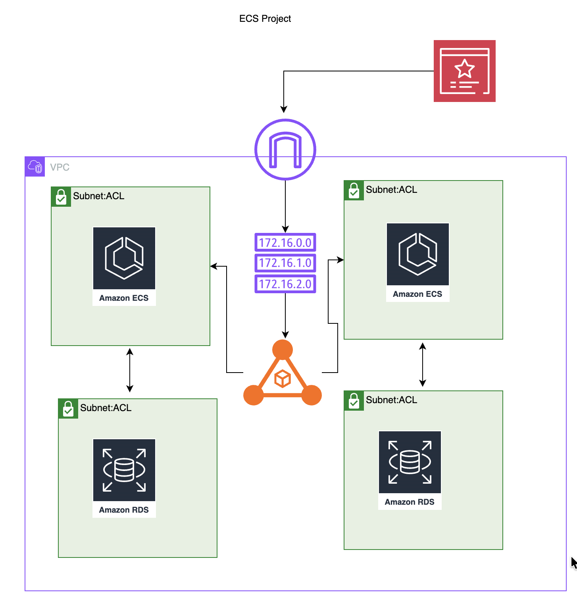
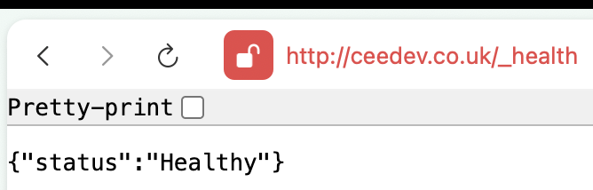

# CoderCo Assignment 1 - Open Source App Hosted on ECS with Terraform

This project is based on Customer Feedback App, an open source tool designed to facilitate customer feedback and improve customer experience. You can explore the tool's dashboard by signing up.

### Task/Assignment

We were assigned to deploy an open source app using Terraform. The app chosen was the Customer Feedback App.

We use a container image for the app, push it to ECR (recommended) or DockerHub, and use a CI/CD pipeline to build, test, and push the container image.

Deploy the app on ECS using Terraform. All the resources should be provisioned using Terraform. Use TF modules.

The app is live on https://ceedev.co.uk/_health or https://ceedev.co.uk/signup

## System Design



## Structure 
```
.
├── main.tf
├── variables.tf
├── outputs.tf
├── terraform.tfvars
├── modules/
│   ├── ecr/
│   │   ├── main.tf
│   │   ├── variables.tf
│   │   └── outputs.tf
│   ├── ecs/
│   │   ├── main.tf
│   │   ├── variables.tf
│   │   └── outputs.tf
│   └── vpc/
│       ├── main.tf
│       ├── variables.tf
│       └── outputs.tf
```

## Build App

```bash
terraform init
terraform plan
terraform apply
```

## Health Check Confirmation


## Feature improvements
we will add cognito to allow authentication and authorization
we will be using the count for private subnets since they only used for rds.
We will be adding SES for emails 
bootstrap with ecr.
