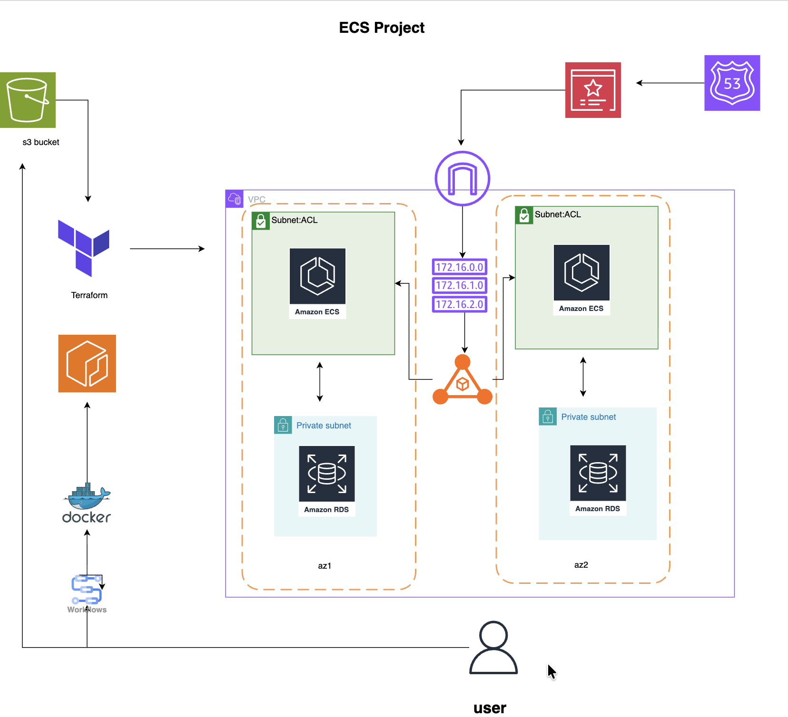
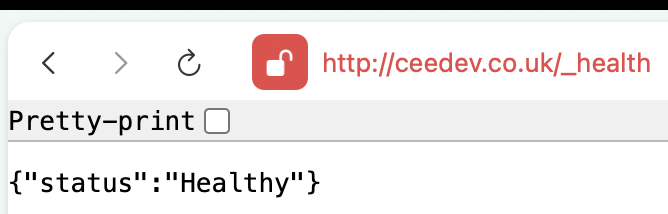
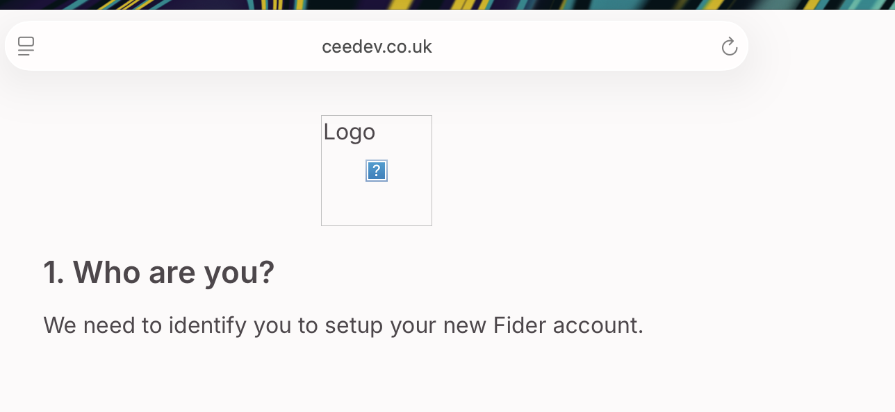
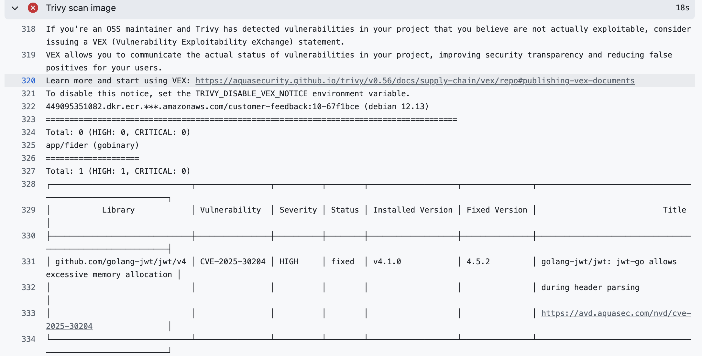
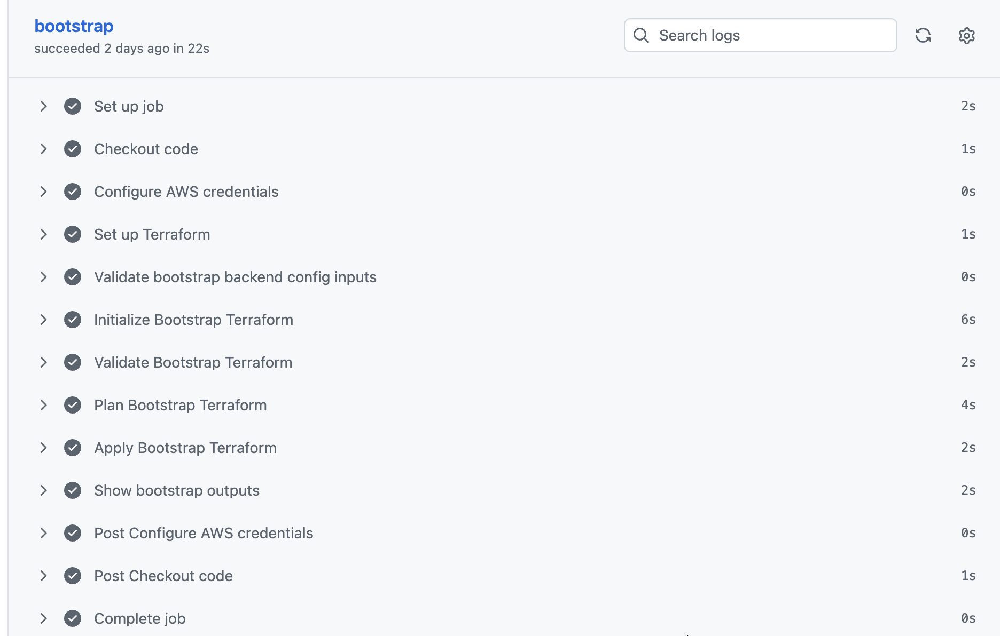
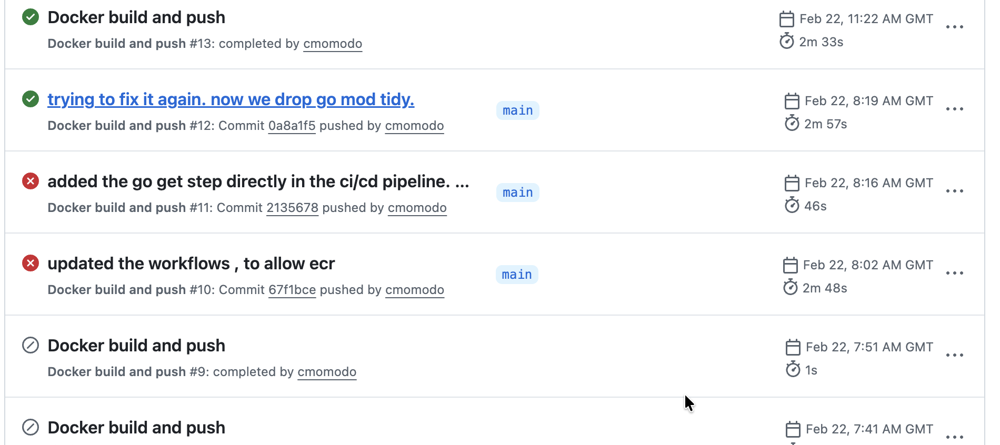
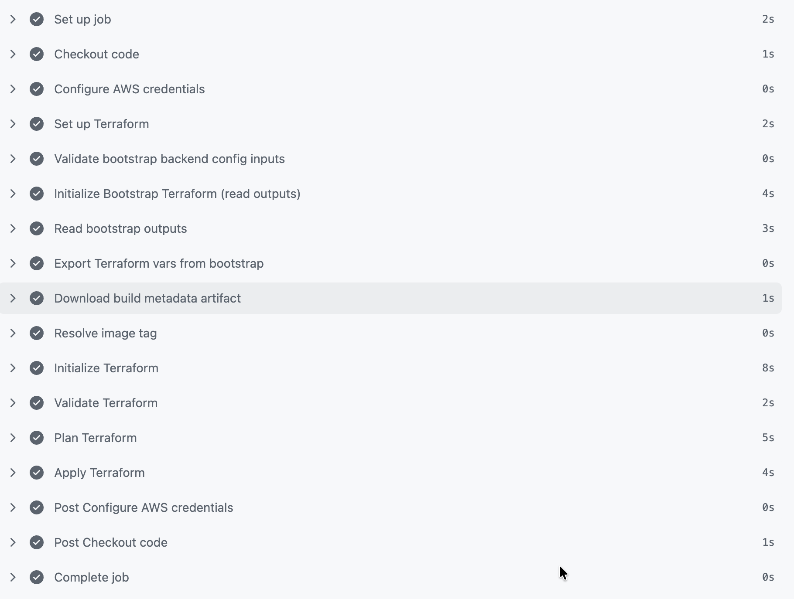
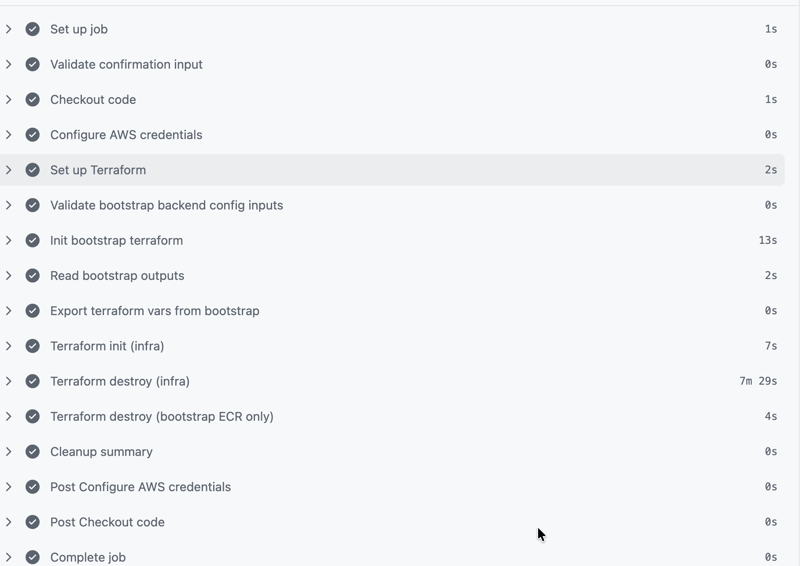

# Customer Feedback App

This project is based on Customer Feedback App, an open source tool designed to facilitate customer feedback and improve customer experience. You can explore the tool's dashboard by signing up. We are currently working on adding authentication and authorization features using Cognito. We will also be adding SES for email notifications.

### Task

We were assigned to deploy an open source app using Terraform. The app chosen was the Customer Feedback App.
We use a container image for the app, push it to ECR (recommended) or DockerHub, and use a CI/CD pipeline to build, test, and push the container image.
Deploy the app on ECS using Terraform. All the resources should be provisioned using Terraform. Use TF modules.
We will be using the CI/CD pipelines for easy deployment and automation. We have 4 different pipelines.
The app is live on https://ceedev.co.uk/_health or https://ceedev.co.uk/signup

## System Design


## Project Structure

```
.
├── .github/
│   └── workflows/
│       ├── bootstrap.yaml
│       ├── build.yaml
│       ├── clean.yaml
│       └── terra.yaml
├── Images/
│   ├── ecs_p1.png
│   ├── health_check.png
│   ├── https.png
│   ├── system_design.png
│   └── trivy_scan.png
├── app/
│   └── fider-main/
│       ├── .github/
│       ├── app/
│       ├── e2e/
│       ├── etc/
│       ├── locale/
│       ├── migrations/
│       ├── public/
│       ├── scripts/
│       ├── views/
│       └── ...
├── bootstrap/
│   ├── gh_example.sh
│   ├── gh_setup.sh
│   ├── main.tf
│   ├── outputs.tf
│   ├── providers.tf
│   ├── README.md
│   ├── terraform.tfvars.example
│   └── variables.tf
├── infra/
│   ├── generated-diagrams/
│   ├── modules/
│   │   ├── acm/
│   │   ├── alb/
│   │   ├── ecs/
│   │   ├── iam/
│   │   ├── rds/
│   │   ├── secrets/
│   │   └── vpc/
│   ├── polices/
│   ├── .terraform.lock.hcl
│   ├── aws.tf
│   ├── main.tf
│   ├── state.tf
│   ├── terraform.tfvars
│   ├── terraform.tfvars.example
│   └── variables.tf
├── .gitignore
├── .pre-commit-config.yaml
├── local_run.py
└── README.md
```

## Build App

```bash
terraform -chdir=bootstrap init -reconfigure \
  -backend-config='bucket=my-27-state-bucket' \
  -backend-config='region=us-east-1'

terraform -chdir=bootstrap plan -var-file=boot.tfvars
terraform -chdir=bootstrap apply -var-file=boot.tfvars

```

## Health Check Confirmation


## HTTPs Confirmation


## Docker


- Created a non-root user.
- Used the COPY commands in one line.
- Managed to fix the run time from 30 minutes to 2 minutes.
- Trivy scan added to CI/CD pipeline.

## Pipelines
Bootstrap workflow: create the ecr repository


Docker workflow: build and push the docker image


Infrastructure workflow: deploy the application


Clean up workflow: delete Everything


## Certificate
For the HTTPS certificate, it's easier to use the CLI. This was suggested by Amazon Q.

```bash
aws acm request-certificate --domain-name ceedev.co.uk --validation-method DNS
```

## Feature Improvements

- We will add Cognito to allow authentication and authorization.
- We will be adding SES for emails.
- We have been shipping different versions of secrets because it gets retained for 7 days
- When using secrets with a different version number, even after deployment there's a delay of 7 days before it's gone, that's why we now set it to zero
- My computer is a Mac which uses amd64 but GitHub Actions uses x86_64, so I normally have to switch between them
- Create a script for local execution
- Implement checkov into the CI/CD pipeline.
