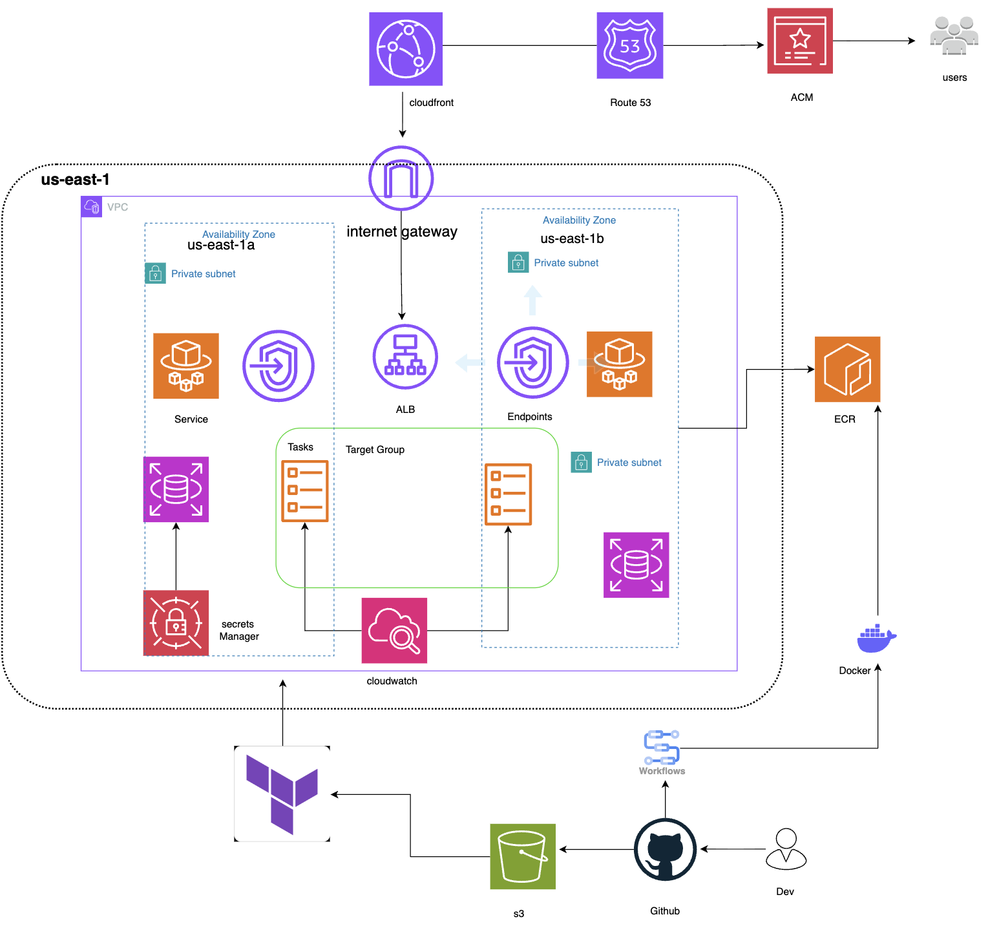
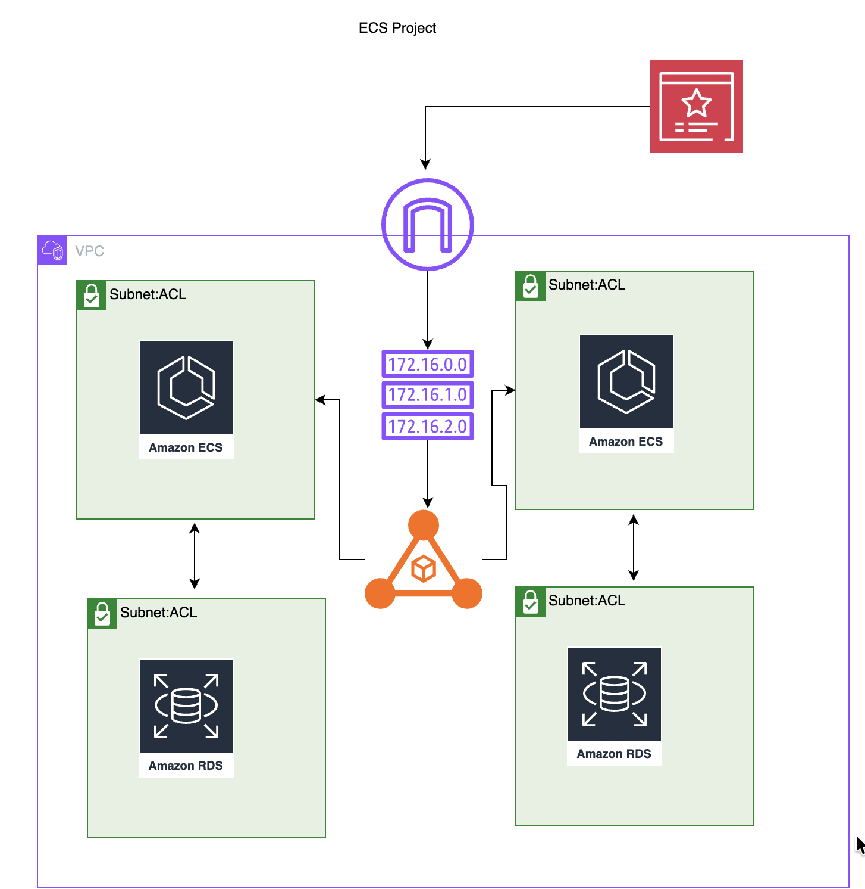

# LinkUp's Customer Feedback App on ECS

This project is based on Customer Feedback App, an open source tool designed to facilitate customer feedback and improve customer experience. This is a full stack application that includes a frontend, backend, and database. we have a pre-commit hook to run checks on the code. Pipelines are used to build, test, and push the container image. The app is live on [https://ceedev.co.uk/\_health](https://ceedev.co.uk/_health) or [https://ceedev.co.uk/signup](https://ceedev.co.uk/signup).

## System Design

System Design Diagram


## Project Structure

```
.
├── .github/
│   └── workflows/
│       ├── bootstrap.yaml
│       ├── build.yaml
│       ├── clean.yaml
│       └── terra.yaml
├── Images/
│   ├── ecs_p1.png
│   ├── health_check.png
│   ├── https.png
│   ├── system_design.png
│   └── trivy_scan.png
├── app/
│   └── fider-main/
│       ├── .github/
│       ├── app/
│       ├── e2e/
│       ├── etc/
│       ├── locale/
│       ├── migrations/
│       ├── public/
│       ├── scripts/
│       ├── views/
│       └── ...
├── bootstrap/
│   ├── gh_example.sh
│   ├── gh_setup.sh
│   ├── main.tf
│   ├── outputs.tf
│   ├── providers.tf
│   ├── README.md
│   ├── terraform.tfvars.example
│   └── variables.tf
├── infra/
│   ├── generated-diagrams/
│   ├── modules/
│   │   ├── acm/
│   │   ├── alb/
│   │   ├── ecs/
│   │   ├── iam/
│   │   ├── rds/
│   │   ├── secrets/
│   │   └── vpc/
│   ├── polices/
│   ├── .terraform.lock.hcl
│   ├── aws.tf
│   ├── main.tf
│   ├── state.tf
│   ├── terraform.tfvars
│   ├── terraform.tfvars.example
│   └── variables.tf
├── .gitignore
├── .pre-commit-config.yaml
├── local_run.py
└── README.md
```

## Build App

```bash
terraform apply -auto-approve
```

### Bootstrap build

```bash
terraform -chdir=bootstrap init -reconfigure \
  -backend-config='bucket=my-27-state-bucket' \
  -backend-config='region=us-east-1'

terraform -chdir=bootstrap plan -var-file=boot.tfvars
terraform -chdir=bootstrap apply -var-file=boot.tfvars

```

## Health Check Confirmation


## HTTPs Confirmation


## Docker




- Created a non-root user.
- Used the COPY commands in one line.
- Managed to fix the run time from 30 minutes to 2 minutes.
- Trivy scan added to CI/CD pipeline.
- GitHub Actions builds and pushes the app image for `linux/arm64`.
- Terraform deploys the exact image tag produced by the Docker workflow so ECS registers a new task definition revision and rolls the service forward.

## Pipelines

**Bootstrap workflow:** create the ECR repository


**Docker workflow:** build and push the Docker image


The Docker workflow publishes a unique image tag artifact after each successful ARM64 build.

**Infrastructure workflow:** deploy the application


The infrastructure workflow reads that artifact, sets `TF_VAR_image_tag`, and updates the ECS task definition and service to the new image revision.

**Clean up workflow:** delete everything


## Certificate

For the HTTPS certificate, it's easier to use the CLI. This was suggested by Amazon Q. Also saves time when the cicd pipeline is running.

```bash
aws acm request-certificate --domain-name ceedev.co.uk --validation-method DNS
```

## Feature Improvements

- We will add Cognito to allow authentication and authorization.
- We will be adding SES for emails.
- Create a script for local execution.
- Implement checkov into the CI/CD pipeline.
