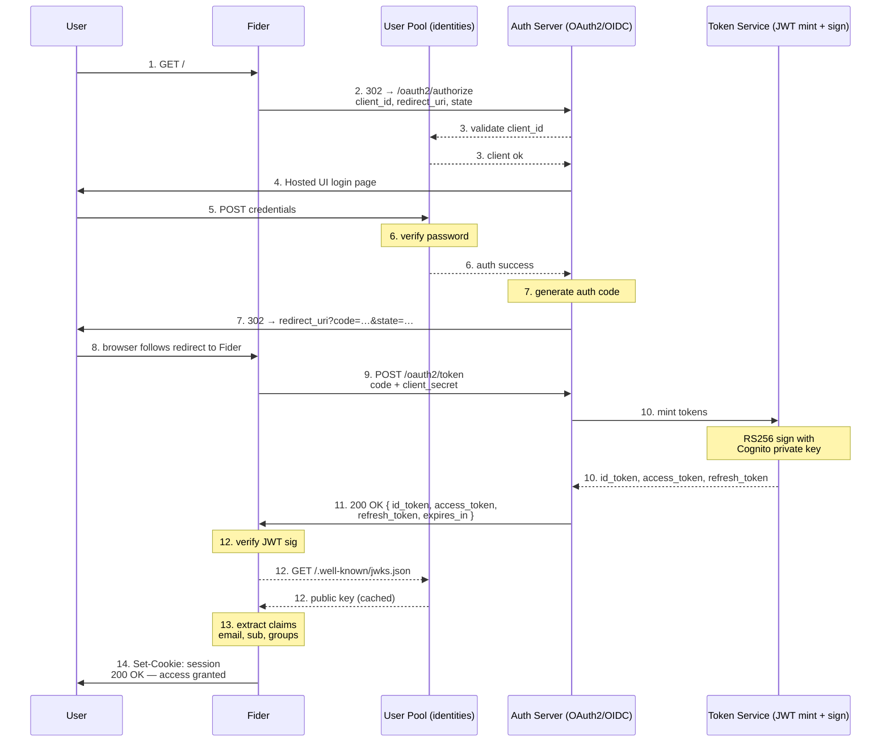

```mermaid
sequenceDiagram
participant U as User
participant F as Fider
participant UP as User Pool (identities)
participant AS as Auth Server (OAuth2/OIDC)
participant TS as Token Service (JWT mint + sign)

    U->>F: 1. GET /
    F->>AS: 2. 302 → /oauth2/authorize<br/>client_id, redirect_uri, state
    AS-->>UP: 3. validate client_id
    UP-->>AS: 3. client ok
    AS->>U: 4. Hosted UI login page
    U->>UP: 5. POST credentials
    Note over UP: 6. verify password
    UP-->>AS: 6. auth success
    Note over AS: 7. generate auth code
    AS->>U: 7. 302 → redirect_uri?code=…&state=…
    U->>F: 8. browser follows redirect to Fider
    F->>AS: 9. POST /oauth2/token<br/>code + client_secret
    AS->>TS: 10. mint tokens
    Note over TS: RS256 sign with<br/>Cognito private key
    TS-->>AS: 10. id_token, access_token, refresh_token
    AS->>F: 11. 200 OK { id_token, access_token,<br/>refresh_token, expires_in }
    Note over F: 12. verify JWT sig
    F-->>UP: 12. GET /.well-known/jwks.json
    UP-->>F: 12. public key (cached)
    Note over F: 13. extract claims<br/>email, sub, groups
    F->>U: 14. Set-Cookie: session<br/>200 OK — access granted
```
